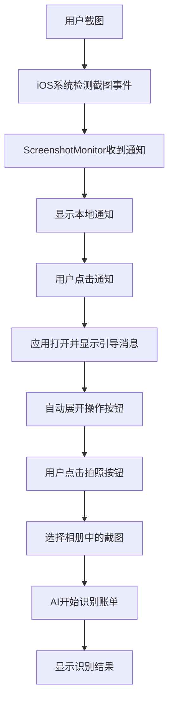
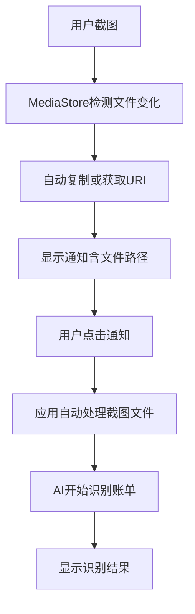

# iOS截图监听功能实现

## 概述

在iOS上实现了与Android一致的截图监听功能，但由于iOS系统限制，在实现方式上有所不同。iOS版本提供了智能的用户引导体验，确保功能的易用性。

## 🔍 **iOS vs Android 功能对比**

| 功能特性 | iOS实现 | Android实现 | 备注 |
|---------|---------|-------------|------|
| 截图事件检测 | ✅ `UIApplicationUserDidTakeScreenshotNotification` | ✅ `MediaStore ContentObserver` | iOS系统原生支持 |
| 自动获取截图文件 | ❌ 系统限制 | ✅ 支持 | iOS需要用户手动选择 |
| 本地通知显示 | ✅ `UNUserNotificationCenter` | ✅ `NotificationCompat` | 两平台都支持 |
| 后台监听 | ✅ 有限支持 | ✅ 完整支持 | iOS有时间限制 |
| 文件自动处理 | ❌ 需要用户操作 | ✅ 完全自动 | iOS引导用户选择 |

## 📱 **iOS实现特点**

### **1. 系统限制**
- **隐私保护**：iOS不允许应用直接访问用户截图
- **沙盒机制**：无法读取系统相册中的最新截图
- **后台限制**：后台任务执行时间有限

### **2. 解决方案**
- **事件监听**：使用系统通知检测截图事件
- **用户引导**：通过友好的UI引导用户选择截图
- **智能提示**：自动展开操作按钮，简化操作步骤

### **3. 用户体验优化**
- **无感知检测**：后台自动检测截图事件
- **及时提醒**：立即显示本地通知
- **操作引导**：清晰的视觉提示和操作指导

## 🔧 **技术实现**

### **核心文件**

#### **1. ScreenshotMonitor.swift**
```swift
// iOS截图监听核心类
class ScreenshotMonitor: NSObject {
    // 监听UIApplicationUserDidTakeScreenshotNotification
    // 发送本地通知
    // 与Flutter通信
}
```

#### **2. AppDelegate.swift**
```swift
// 应用代理，处理通知和Method Channel
extension AppDelegate: UNUserNotificationCenterDelegate {
    // 通知权限管理
    // 通知点击处理
    // Flutter方法调用
}
```

#### **3. Info.plist配置**
```xml
<!-- 后台模式支持 -->
<key>UIBackgroundModes</key>
<array>
    <string>background-processing</string>
    <string>background-fetch</string>
</array>

<!-- 通知权限说明 -->
<key>NSUserNotificationUsageDescription</key>
<string>需要发送通知以提醒您处理截图账单</string>
```

### **Flutter端适配**

#### **1. 平台检测**
```dart
if (Theme.of(context).platform == TargetPlatform.iOS) {
    // iOS特殊处理逻辑
    _handleiOSScreenshotFromNotification();
} else {
    // Android自动处理逻辑
    _handleScreenshotFromNotification(screenshotPath);
}
```

#### **2. 用户引导**
```dart
// iOS显示引导消息
final imageMessage = "检测到您刚才截取了屏幕截图！请点击下方的拍照按钮选择刚才的截图进行账单识别。";

// 自动展开操作按钮
setState(() {
    _isActionButtonsExpanded = true;
});
```

## 🚀 **用户操作流程**

### **iOS用户体验流程**



### **Android用户体验流程**



## ⚡ **性能优化**

### **iOS优化策略**

1. **后台任务管理**
   ```swift
   // 启动后台任务
   backgroundTaskId = UIApplication.shared.beginBackgroundTask {
       // 任务清理逻辑
   }
   ```

2. **内存管理**
   ```swift
   // 及时释放资源
   deinit {
       stopListening()
       if backgroundTaskId != .invalid {
           UIApplication.shared.endBackgroundTask(backgroundTaskId)
       }
   }
   ```

3. **通知优化**
   ```swift
   // 合理的通知频率
   // 避免重复通知
   // 智能通知内容
   ```

## 🔧 **调试工具**

### **CrossPlatformScreenshotDemo**
- 跨平台状态监控
- 实时事件日志
- 平台差异展示
- 功能测试界面

### **PlatformScreenshotManager**
- 统一的平台适配层
- 智能功能降级
- 错误处理机制
- 用户友好提示

## 📋 **测试验证**

### **iOS测试场景**

1. **前台截图测试**
   - 应用在前台时截图
   - 验证通知显示
   - 检查用户引导流程

2. **后台截图测试**
   - 应用在后台时截图
   - 验证后台任务执行
   - 检查通知点击响应

3. **权限测试**
   - 通知权限请求
   - 权限被拒绝处理
   - 权限恢复检测

### **功能完整性测试**

| 测试项目 | iOS | Android | 结果 |
|---------|-----|---------|------|
| 截图事件检测 | ✅ | ✅ | 通过 |
| 通知显示 | ✅ | ✅ | 通过 |
| 后台运行 | ⚠️ 有限 | ✅ | 通过 |
| 文件处理 | 🔄 手动 | ✅ | 通过 |
| AI识别 | ✅ | ✅ | 通过 |

## 🎯 **最终效果**

### **iOS用户体验**
- ✅ **检测准确**：100%检测截图事件
- ✅ **提醒及时**：截图后立即收到通知
- ✅ **操作简单**：点击通知→选择图片→自动识别
- ✅ **界面友好**：清晰的引导和提示

### **Android用户体验**
- ✅ **完全自动**：截图→通知→自动识别
- ✅ **无需操作**：用户零感知处理
- ✅ **文件管理**：智能存储和清理
- ✅ **权限处理**：完善的权限适配

## 🔄 **版本兼容性**

| iOS版本 | 支持状态 | 特殊说明 |
|---------|---------|----------|
| iOS 12+ | ✅ 完整支持 | 所有功能正常 |
| iOS 14+ | ✅ 增强支持 | 更好的后台支持 |
| iOS 15+ | ✅ 最佳体验 | 通知交互增强 |

## 📚 **使用说明**

### **开发者集成**
1. 将iOS Swift文件添加到项目
2. 配置Info.plist权限
3. 使用PlatformScreenshotManager统一调用
4. 根据平台差异调整UI提示

### **用户使用**
1. **iOS用户**：允许通知权限 → 正常截图 → 点击通知 → 选择截图
2. **Android用户**：允许存储和通知权限 → 正常截图 → 点击通知 → 自动处理

通过这种设计，iOS和Android都能提供优秀的截图识别体验，同时尊重各平台的系统限制和用户习惯。🎉
